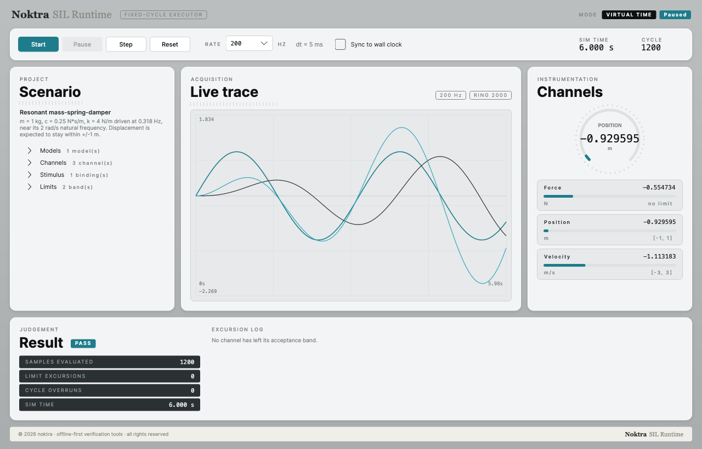
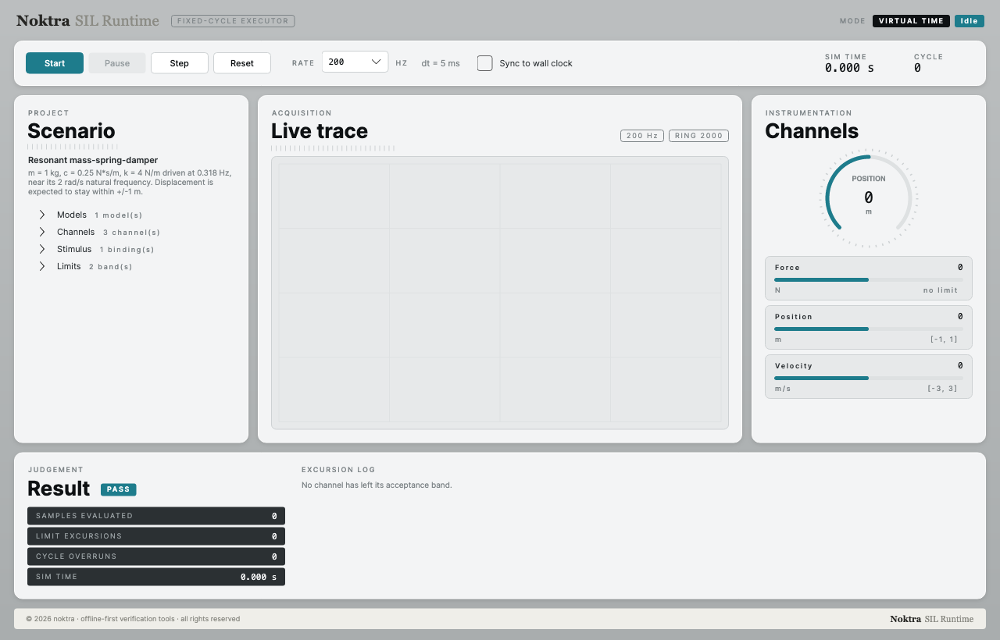
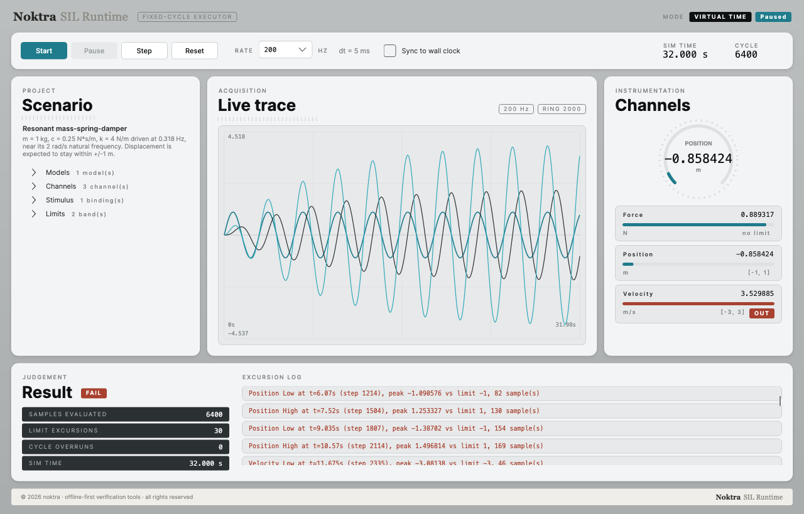

# Noktra SIL Runtime

A fixed-cycle model execution engine for software-in-the-loop testing. Run a plant model and the
compiled control code that drives it on the same deterministic clock, inject stimulus, watch it
live, log it, and judge it against acceptance limits — with no hardware and no cloud.

Offline-first by design: nothing here calls out to a network, and it is meant to work on a closed
network where that is not merely a preference.



<table>
<tr>
<td width="50%"></td>
<td width="50%"></td>
</tr>
<tr>
<td align="center"><sub>Scenario loaded, clock at zero</sub></td>
<td align="center"><sub>Resonance breaks the band — verdict flips to FAIL</sub></td>
</tr>
</table>

## Using it

**1. Start the app.**

```sh
dotnet run --project src/Sil.App
```

It opens with a built-in scenario: a lightly damped mass-spring-damper driven near its natural
frequency, with acceptance bands on displacement and velocity.

**2. Run it.** `Start` runs continuously, `Pause` stops at the next cycle boundary, `Step` advances
exactly one cycle, `Reset` returns to t=0. Pick the rate (1–1000 Hz) before starting.

`Sync to wall clock` paces one simulated second to about one real second so you can watch it. Turn
it off and the same run completes as fast as the machine allows — **with identical numbers**. Rate
and timing mode are properties of the engine, so changing either rebuilds from t=0.

**3. Read it.**

| Panel | Shows |
|---|---|
| **Scenario** | models, channels, stimulus bindings and limit bands as loaded |
| **Live trace** | recent history of every channel, from a bounded ring buffer |
| **Channels** | a dial for the headline channel plus live values against their bands |
| **Result** | PASS/FAIL, run statistics, and every limit excursion with its time and peak |

A channel outside its band turns red and gets an `OUT` tag; the verdict flips to `FAIL` and the
excursion is logged with its start time, cycle index, peak value and duration in samples.

**4. Watch for overruns.** In wall-clock mode `CYCLE OVERRUNS` counts cycles that missed their
deadline. A non-zero count means the loop could not keep up in real time — the results are still
correct, they just took longer than wall-clock to produce.

## Scope

**What it does.** MIL and SIL: model against model, and model against compiled code. A fixed-step
loop from 1 Hz to 1 kHz on a virtual clock, with optional wall-clock pacing for live viewing.

**What it deliberately does not do.** Hard real-time HIL. There is no attempt at bounded
worst-case latency, no kernel driver and no I/O card. Wall-clock mode paces the loop and reports
overruns; it does not guarantee them away. If you need hard real-time, this is the wrong tool and
saying so up front is more useful than pretending otherwise.

## Determinism

The whole product rests on one property: **the same scenario produces the same numbers, every
run, on every machine.** Everything else is built to protect it.

- Simulation time is always `stepIndex * dt`, never accumulated, so a step index maps to exactly
  one `double` and 10,000 cycles at 1 kHz land on 10.0 s with no drift.
- The cycle is a fixed, ordered task list. Nothing is scheduled adaptively and nothing depends on
  how fast the host is.
- Wall-clock pacing is a separate layer that decides *when* a cycle runs, never *what* it
  computes. A paced run and a virtual run are asserted to agree bit-for-bit.
- Live display traces are ring buffers outside the deterministic path. Dropping a display sample
  can never change a result.
- CSV logs are byte-reproducible: LF endings on every platform, UTF-8 without BOM, invariant
  round-trip number formatting, and no wall-clock timestamp written into the file. Running the
  same scenario twice and diffing the logs is a valid regression check.

## Verification

Correctness is pinned to values computed independently of the implementation and then frozen in
`tests/Sil.Core.Tests/GoldenVectors.cs`. Tests read them; they are never edited to make a change
pass.

| Check | Reference |
|---|---|
| Euler, `dx/dt = -x`, x0=1, dt=0.1, 10 steps | 0.3486784401 |
| RK4, same conditions, 1 step / 10 steps | 0.9048375000 / 0.3678797744 |
| RK4 vs. the analytic `e^-1` | agrees within 1e-6 |
| Channel mapping, raw 10 with a=2, b=1 | 21 |
| Step stimulus at t=0.99 / t=1.00 | 0 / 5 |
| Ramp 0→10 over 2 s, at t=1.0 | 5 |
| Limits [4.5, 5.5] against [4.9, 5.6] | one HIGH violation, verdict FAIL |
| Same scenario run twice | byte-identical CSV |

Beyond the frozen vectors, results are checked against closed-form solutions rather than recorded
traces: first-order step response at one time constant, undamped oscillator against `cos(ωt)`,
`F/k` settling, and the closed loop's analytic steady state. Where two implementations should
agree exactly, the test asserts **bit-for-bit** equality rather than a tolerance — the C reference
model against the managed integrator, the compiled PI controller against the managed one, and a
scenario built from JSON against the same system wired by hand.

## Quick start

```sh
dotnet build                                       # zero warnings, zero errors
dotnet test                                        # full suite
dotnet run --project src/Sil.App                   # the shell
dotnet run --project src/Sil.App -- --smoke        # headless self-check, exits 0 on success
```

The native ABI tests compile the reference C models during the test run, so a C compiler
(`cc`, `gcc` or `clang`) must be on `PATH`. If none is found the tests **fail rather than skip**:
a contract test that silently disappears is worse than no test.

Documentation images are generated, not captured:

```sh
dotnet run --project src/Sil.App -- --screenshot docs/screenshots
```

The shell is laid out and rendered straight to PNG, with the simulation stepped a fixed number of
cycles on virtual time. No display server, no capture permission, and the same bytes every run — so
the screenshots are reproducible for the same reason the results are.

### Running a scenario in code

```csharp
using RunnableScenario scenario = ScenarioBuilder.Load("loop.silscenario.json");
using CsvChannelLogger log = CsvChannelLogger.ToFile(scenario.System.Channels, "run.csv");

ScenarioResult result = scenario.RunToCompletion(extraRecorders: [log]);

Console.WriteLine(result.Passed ? "PASS" : $"FAIL: {result.Violations[0]}");
```

## Scenario files

One JSON document describes a whole scenario — models, channels, wiring, stimulus, limits and run
settings. It is meant to be read, diffed and edited by hand.

```json
{
  "formatVersion": 1,
  "name": "closed-loop-pi",
  "rateHz": 1000,
  "models": [
    { "name": "plant", "kind": "FirstOrderLag", "integrator": "Rk4",
      "parameters": { "timeConstant": 0.5, "gain": 1.0 } },
    { "name": "controller", "kind": "Native", "libraryPath": "libsil_pi_controller.dylib" }
  ],
  "channels": [
    { "name": "Setpoint", "unit": "eu" },
    { "name": "Measurement", "unit": "eu" }
  ],
  "mappings": [
    { "model": "controller", "port": "setpoint", "channel": "Setpoint" },
    { "model": "plant", "port": "x", "channel": "Measurement" }
  ],
  "links": [
    { "sourceModel": "controller", "sourcePort": "u", "targetModel": "plant", "targetPort": "u" },
    { "sourceModel": "plant", "sourcePort": "x", "targetModel": "controller", "targetPort": "measurement" }
  ],
  "stimulus": [
    { "channel": "Setpoint", "kind": "Step", "parameters": { "startTime": 0.0, "after": 1.0 } }
  ],
  "limits": [ { "channel": "Measurement", "low": -0.05, "high": 1.25 } ],
  "run": { "endTime": 10.0, "logDecimation": 10 }
}
```

Model kinds: `FirstOrderLag`, `MassSpringDamper`, `PiController`, `Native`.
Stimulus kinds: `Constant`, `Step`, `Ramp`, `Sine`, `Csv`.

**Unknown names are errors, not defaults.** A misspelled `timeconstant` is rejected, naming both
the offending key and the recognised ones. A scenario that quietly dropped a gain would produce
numbers that look plausible and are wrong, which is the exact failure this tool exists to catch.

Relative `libraryPath` and `csvPath` values resolve against the scenario file's own directory, so
a scenario folder moves as a unit.

## Running compiled control code

A model can be a shared library implementing the SIL native ABI v1 — this is the path that runs
the same C the target compiles.

```c
#include "sil_model.h"

int32_t sil_abi_version(void);
int32_t sil_init(void** instance);
int32_t sil_step(void* instance, double dt);
int32_t sil_port_count(void* instance, int32_t* count);
int32_t sil_port_info(void* instance, int32_t index, sil_port_info_t* info);
int32_t sil_get(void* instance, int32_t index, double* value);
int32_t sil_set(void* instance, int32_t index, double value);
void    sil_free(void* instance);
```

The contract is frozen in [`spec/native-abi.md`](spec/native-abi.md); the canonical header and two
reference models live in [`src/Sil.NativeSpec`](src/Sil.NativeSpec). The loader checks the ABI
version, resolves all eight exports and validates the port table before the model reaches the
cycle, so a mistake shows up as a load error naming the library rather than as bad numbers in a
result file.

Build a model with:

```sh
cc -O2 -std=c11 -ffp-contract=off -shared -fPIC -Iinclude src/my_model.c -o libmy_model.dylib
```

`-ffp-contract=off` matters: without it the compiler may fuse a multiply and an add into an FMA,
which is more accurate but produces a *different* number than the managed integrator. The tests
assert bit-for-bit agreement, and that only holds when neither side contracts.

## Execution cycle

One cycle runs a fixed, ordered task list:

```
system-init → stimulus → model links → channels to inputs
            → models step (declaration order) → outputs to channels → recorders
```

Model-to-model links propagate *before* the models step, so a value crossing a feedback link is
the one its source published at the end of the previous cycle. That one-cycle transport delay is
deliberate: it breaks the algebraic loop and keeps the cycle order fixed. It changes a transient,
never a steady state — the closed-loop tests confirm the settled value is identical at 100, 500
and 1000 Hz.

Two writers on one destination is a build-time error, not a last-writer-wins rule.

## Layout

```
src/Sil.Core/         engine, models, channels, stimulus, native loader, logging, scenarios
src/Sil.App/          Avalonia shell
src/Sil.NativeSpec/   canonical C header and reference models (source only, not a .NET project)
spec/                 frozen external contracts
tests/                xUnit suites
```

`Sil.Core` has no dependencies beyond the framework. The shell depends on the core; nothing
depends on the shell.

## Publishing

```sh
dotnet publish src/Sil.App -c Release -r win-x64 --self-contained true \
  -p:PublishSingleFile=true -p:IncludeNativeLibrariesForSelfExtract=true \
  -p:EnableCompressionInSingleFile=true -o publish/win-x64
```

Produces a single `Sil.App.exe` with no runtime prerequisite. Scenario serialisation uses
source-generated JSON rather than reflection so the format keeps working under a trimmed publish.

## Design system

The interface follows the Noktra design language shared across these tools: a warm neutral canvas,
off-white instrument panels, and **one** accent — teal, used only to mark a live value. Black
backgrounds are reserved for chips that *name* something (mode, state, verdict), never for general
emphasis. 9px uppercase micro-labels carry the texture and each panel gets exactly one bold title.
Tokens live in `src/Sil.App/Theme/NoktraTokens.axaml`; no view hard-codes a colour.

## Stack

.NET 8 · C# 12 · Avalonia 11 · CommunityToolkit.Mvvm · xUnit. The dependency list is deliberately
short and closed.

## Licence

Copyright Noktra. All rights reserved.
